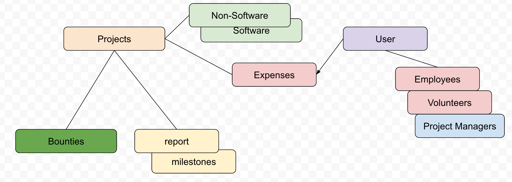
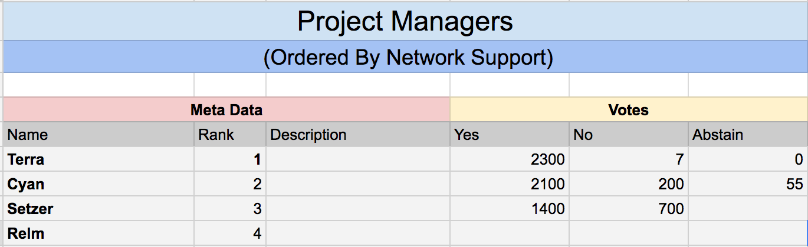
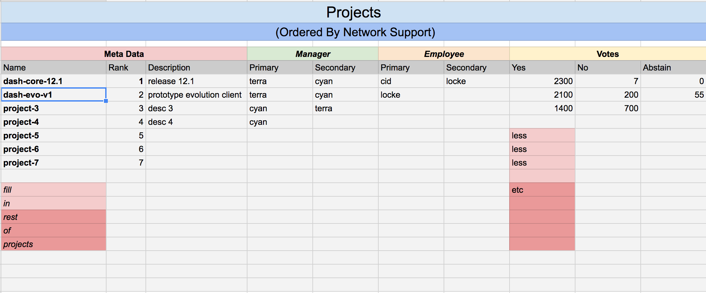
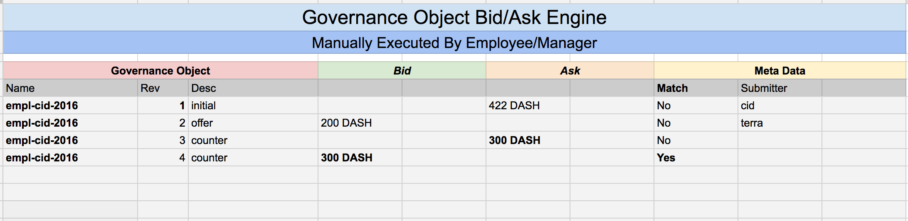

# Dash Project Management Tour 

<pre>
The system can store many types of project management objects, such as projects (software and non-software). Users can be employees, volunteers or managers. Projects can also carry reports, milestones and bounties. Combined we can arrange projects however we see fix.
</pre>

<pre>
Control of the process all goes back to masternode operators and projects. Support for projects and project managers are signaled by counting votes. 
</pre>

<pre>
Project managers and projects are sorted by network support.
</pre>

<pre>
Project payments are calculated with a bid/ask engine. All other payments use this mechanism as well (expenses and salaries)
</pre>

